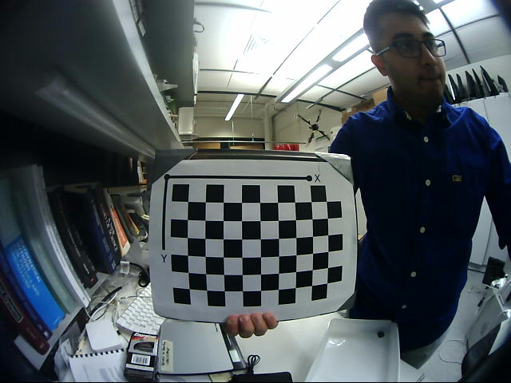
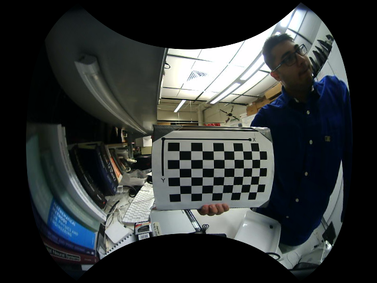
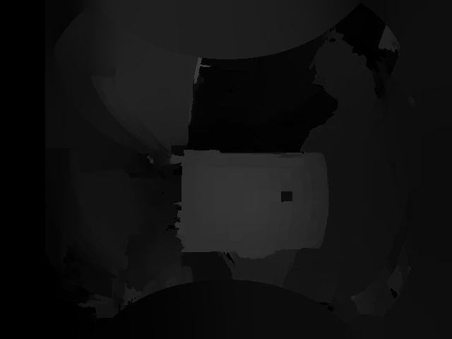

# Stereo-Depth-map-generation-3D-Reconstruction

The goal of this repository is to generates depth maps from a stereo pair of images and to perform 3D reconstruction on these set of images. The images were captured from a fisheye stereo camera. The camera is calibrated using the omnidirectional camera calibration toolbox[here](https://github.com/jiuerbujie/omnidirectional_calibration)


## Files included
This repository consists: 
* `main.cpp` (calibration,recification and depth map generation )
* `depth_filter.cpp` (depth map generation for rectified images using filters)


## Dependencies


* `OpenCV-3.3.0`
* `cmake`

## Pipeline

* Calibrate camera - camera intrinsics and extrinsic parameters
* Rectify Image - Align image pixels on epipolar lines to aid in disparity generation
* Generate depth maps 
* Perform 3D reconstruction- Project 2d pixels into its real world 3D coordinates,

## Run Instructions

```bash

git clone 
cd stereo-depth-reconstruction
mkdir build
cd build
cmake ..
make
./main 
```
---


## Results

* Uncalibrated Image

<figure>
 
 <figcaption>
 <p></p> 
 </figcaption>
</figure>

* Calibrated and rectified Image
<figure>
 
 <figcaption>
 <p></p> 
 </figcaption>
</figure>

* Depth Image
<figure>
 
 <figcaption>
 <p></p> 
 </figcaption>
</figure>


